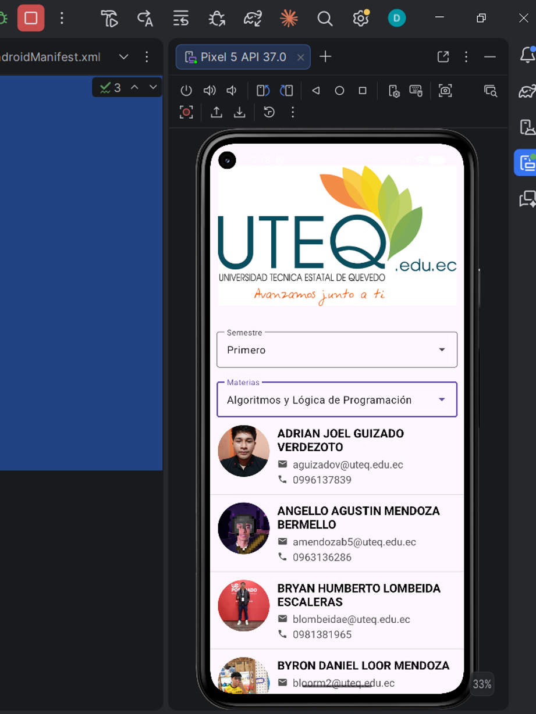
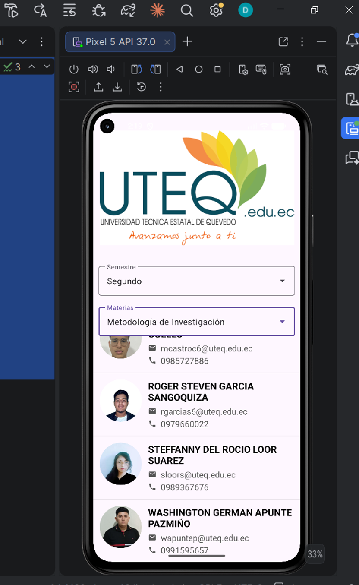

# Consulta de Alumnos — App Android con Supabase

Aplicación Android nativa en Kotlin que consulta una tabla de alumnos almacenada en Supabase y los muestra en un `ListView` con diseño personalizado. Permite filtrar por semestre y materia mediante menús desplegables en cascada.

---

## Tecnologías

- **Kotlin** — lenguaje principal
- **Supabase (postgrest-kt)** — cliente oficial de Supabase para Android; consultas a la base de datos mediante el SDK de Kotlin
- **Glide** — carga y visualización de imágenes con `circleCrop` para fotos circulares
- **Ktor** — motor HTTP utilizado por el cliente Supabase
- **ListView + ArrayAdapter personalizado** — visualización de la lista de alumnos con ítem personalizado

---

## Características

- Dropdown de **semestre** (nivel) que carga dinámicamente las materias disponibles
- Dropdown de **materia en cascada**: al seleccionar un semestre se actualizan las materias correspondientes
- `ListView` con diseño personalizado por alumno:
  - Foto circular del alumno (cargada desde URL con Glide)
  - Nombre completo
  - Correo electrónico con ícono
  - Teléfono con ícono
- Consulta asíncrona a Supabase ordenada alfabéticamente por nombres (`Order.ASCENDING`)
- Manejo de errores de red con mensajes descriptivos via `SupabaseErrorHandler`

---

## Configuración

Las credenciales de Supabase **no se incluyen en el código fuente**. Se definen en el archivo `local.properties` (ignorado por Git) y se exponen en tiempo de compilación a través de `BuildConfig`.

Crea o edita el archivo `local.properties` en la raíz del proyecto con el siguiente contenido:

```properties
SUPABASE_URL=https://xxxxxxxx.supabase.co
SUPABASE_KEY=tu_anon_key
```

Estas variables se leen desde `build.gradle.kts` y quedan disponibles en el código como `BuildConfig.SUPABASE_URL` y `BuildConfig.SUPABASE_KEY`.

> **Importante:** nunca subas `local.properties` a un repositorio público.

---

## Instalación

1. Clona el repositorio:
   ```bash
   git clone https://github.com/tu-usuario/tu-repo.git
   ```
2. Abre el proyecto en **Android Studio**.
3. Crea el archivo `local.properties` en la raíz con tus credenciales de Supabase (ver sección anterior).
4. Ejecuta **File → Sync Project with Gradle Files**.
5. Ejecuta **Build → Rebuild Project**.
6. Conecta un dispositivo o inicia un emulador y presiona **Run**.

---

## Capturas de pantalla


